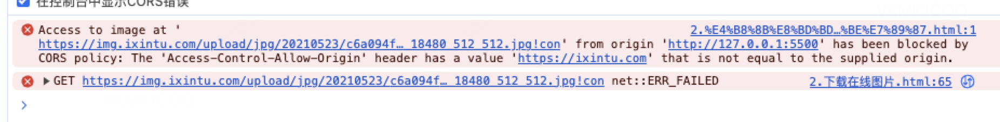
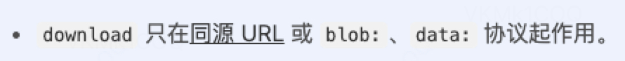
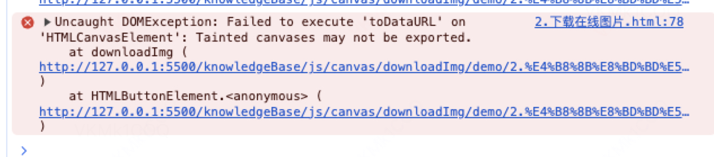
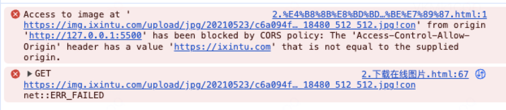

# 下载图片

## 1. 下载本地图片

大家一定都知道如何在网页上展示一张图片，把图片的链接挂载到 `img` 的 `src` 属性上。下载图片也是同理，把图片 `url` 挂载到`a` 标签 `href` 属性上，并添加 `download` 属性告诉浏览器点击这个 `a` 标签不是跳转到图片地址，而是下载图片，从而可以达到下载的目的。

```html
<!-- 展示图片 -->


<!-- 下载图片 -->
<a href="./bgc.png" download="文件名">点击下载图片</a>
```

但是这样会存在一个问题，`url` 如果是在线链接，会遇到点击 `a` 标签依旧不会下载，还是会默认跳转到图片地址。例如：

```html
<!-- 在线图片：无法正常下载 -->

<a href="https://images.pexels.com/photos/26775381/pexels-photo-26775381.jpeg" download="文件名">点击下载图片</a>
```

</img>

其实原因也不难理解：被浏览器安全策略中同源策略给拦截了，造成了跨域报错，导致无法下载：

<a href="https://developer.mozilla.org/zh-CN/docs/Web/HTML/Element/a#download" target="_blank">mdn </a>也给出了 `download` 属性不生效的官方解释：

</img>


## 2. 下载在线图片

那如何下载在线图片呢，解决办法核心就是将在线 `url` 转化为本地的 `url`，即 `download` 属性允许我们使用的 `data:` 协议和 `blob:` 协议的 url，你可以把这两个协议类似 `https:` 协议去理解，当然，`data:` 协议和 `blob:` 协议都肯定与当前页面不同源，那它俩为什么不会触发跨域呢？

`data:` 协议：将资源数据转化为文本编码直接嵌入到 `url` 里，浏览器会直接解析 `url` 的文本编码，不会触发网络请求，避免跨域。

`blob:` 协议：将资源数据转化为本地二进制数据( <a href="https://developer.mozilla.org/zh-CN/docs/Web/API/Blob" target="_blank">Blob 对象</a> )，然后将 `Blob` 对象转化为 `url`，浏览器直接解析 `Blob` 生成的 `url`，由 `blob` 对象是直接由浏览器内部创建的，不会涉及网络请求。

不难发现，`data` 协议和 `blob` 协议本质都是将资源本地化了，一个是将资源转化成文本编码构成的 `url`，一个是转化为 `Blob` 对象生成的 `url`，浏览器都可以直接解析这两种 `url`，不会进行网络请求。

### 2.1 转化为 data: 协议

#### 协议格式：

`data:[<mediatype>][;base64],<data>`

`mediatype`：媒体类型，例如`image/png`，`image/jpeg`等

`base64`：可选，表示资源数据是否经过 `base64` 编码，如果为空，则表示资源数据为文本编码

`data`：资源数据，如果是 `base64` 编码，则表示资源数据经过 `base64` 编码后的数据，否则表示资源数据文本编码

#### 转化过程：

如何将在线 `url` 转化为 `data:` 协议的 `url` 呢，这里需要借助一下 `canvas` 元素，因为他身上有个方法 <a href="https://developer.mozilla.org/zh-CN/docs/Web/API/HTMLCanvasElement/toDataURL" target="_blank">toDataURL</a>，可以将 `canvas` 元素转化为 `data:` 协议的 `base64编码url`。

这里简单介绍下 <a href="https://developer.mozilla.org/zh-CN/docs/Web/HTML/Element/canvas" target="_blank">canvas</a>：`html` 中的一个标签元素: `<canvas>`，你可以把它理解为一个画布，在它内部可以绘制各种图案。

核心思路就是：把在线图片绘制到 `canvas` 元素上，再通过 `toDataURL` 方法把 `canvas` 转化为 `data:` 协议的 `url` 即可。

即 图片 => `canvas` => `data:`协议 `url` => 下载。

```html
<body>
  
  <button>下载图片</button>
</body>

<script>
  const img = document.querySelector("img");
  const button = document.querySelector("button");

  // 下载图片
  const downloadImg = (img, fileName, fileType, width, height) => {
    // 创建canvas画布
    const canvas = document.createElement("canvas");
    // 设置画布类型 2d 可以理解画布能力是二维的平面 其他类型看mdn
    const ctx = canvas.getContext("2d");
    // 一定要设置允许跨域访问
    img.crossOrigin = "Anonymous";

    // 设置crossOrigin属性后，浏览器会重新请求图片，所以需要等图片加载完毕后才绘制
    img.onload = () => {
      // 设置画布宽高（导出图片宽高） 跟图片宽高保持一致即可
      canvas.width = width;
      canvas.height = height;
      // 将图片绘制到画布上
      ctx.drawImage(img, 0, 0, canvas.width, canvas.height);
      document.body.appendChild(canvas);
      // 将canvas转化为url
      const url = canvas.toDataURL(`image/${fileType}`);
      // 通过a标签点击下载
      const a = document.createElement("a");
      // 设置下载地址
      a.href = url;
      // 设置下载图片名
      a.download = fileName;
      a.click();
    };
  };

  button.addEventListener("click", () => {
    downloadImg(img, "文件名", "jpeg", 100, 100);
  });
</script>
```

这里我们实现了自定义文件名、文件类型、图片宽高。

文件名：`download` 属性指定。

文件类型：`toDataURL` 这个方法可以指定类型，支持 `png`，`webp`, `jpeg`这三种类型。

图片宽高：`canvas` 宽高就是我们下载的图片宽高，我们只需控制`canvas` 宽高即可，如果 `canvas` 宽高比与图片宽高比不一致，图片将被拉伸或压缩。

- 为什么一定要给 `img` 设置 `crossOrigin` 属性呢？

  因为默认情况下，在未设置 crossOrigin 的情况下，你可以绘制跨域图片到 `canvas` 上，但不能通过 `JavaScript` 读取 `canvas` 的像素数据，例如使用 `toDataUrl`方法，这种情况下，试图访问 `canvas` 的图像数据时会引发 `SecurityError` 异常。浏览器限制了跨域图像的读取权限，以防止恶意脚本从 `canvas` 中提取数据。具体看<a href="https://developer.mozilla.org/zh-CN/docs/Web/HTML/CORS_enabled_image#%E5%AE%89%E5%85%A8%E6%80%A7%E5%92%8C%E2%80%9C%E8%A2%AB%E6%B1%A1%E6%9F%93%E2%80%9D%E7%9A%84_canvas">mdn</a>解释，不设置会报以下错误：

  

- 发现设置了 `crossOrigin `，但还是会报如下跨域错误呢？

  

  这就是因为图片所在的服务器没有允许你跨域访问，当我们在设置 `img.crossOrigin = "Anonymous"` 就会出现上述报错，就是这张图片所在的服务器不允许你去用哈，解决办法也很简单，自己手动下载到本地，使用本地路径就可以。

### 2.2 转化为 blob: 协议

#### 协议格式：

`blob:<url>`

`url`：资源数据转化为 `Blob` 对象生成的 `url`。

#### 转化过程：

这里我们可以直接通过 `http` 请求中的 `fetch` 函数方式将在线 `url` 的图片资源转化为 `Blob` 对象，再通过 `URL.createObjectURL` 方法将 `Blob` 对象转化为 `url`，浏览器可以直接解析 `Blob` 生成的 `url`。

即 `fetch` 请求图片 => `Blob`对象 => `blob:` 协议 `url` => 下载。

```html
<body>
  
  <button>下载图片</button>
</body>

<script>
  document.querySelector("button").addEventListener("click", () => {
    const imageUrl =
      "https://cdn.glitch.me/4c9ebeb9-8b9a-4adc-ad0a-238d9ae00bb5%2Fmdn_logo-only_color.svg";

    fetch(imageUrl)
      .then((response) => {
        // blob(): 将响应体内容转化为 blob 对象
        return response.blob();
      })
      .then((blob) => {
        // 将 blob 对象转化为 url
        const url = window.URL.createObjectURL(blob);
        const a = document.createElement("a");
        a.href = url;
        a.download = "文件名.jpeg";
        document.body.appendChild(a);
        a.click();
        a.remove();
        window.URL.revokeObjectURL(url);
      })
      .catch((error) => console.error("下载失败:", error));
  });
</script>
```

同样，如果出现跨域了还是服务器不让你使用哈。

### 2.3 最妥善处理跨域图片

其实最安全的办法就是都使用本地下载好的图片，也不用搞 `canvas` 和 `blob` 对象转来转去。

那知道了如何下载图片，可以再思考一个问题，怎么能把 `dom` 元素下载下来呢？就比如我想保存整个页面，当然不是用截屏工具的方式哈。

## 3. 下载 dom 元素

知道了怎么用 `canvas` 下载图片了，也可以用相同的道理下载 `dom` 元素，但不幸的是 `canvas` 本身不支持去绘制 `dom` 元素，也就是 <a href="https://developer.mozilla.org/zh-CN/docs/Web/API/CanvasRenderingContext2D/drawImage" target="_blank">drawImage</a> 方法不支持传 `dom` 元素，所以我们需要使用一个流行的快照 `canvas` 库：<a href="https://html2canvas.hertzen.com/" target="_blank">html2canvas</a>，它实现了处理 `dom` 元素转成 `canvas`，我们再通过`toDataURL` 方法将 `canvas` 转成 `url` 实现下载。

```html
<!-- 引入 html2canvas -->
<script src="https://html2canvas.hertzen.com/dist/html2canvas.min.js"></script>
<body>
  <div>
    
    <button>下载图片</button>
  </div>
</body>
<script>
  const button = document.querySelector("button");
  const div = document.querySelector("div");

  // 下载图片
  const downloadImg = (dom, fileName, fileType, width, height) => {
    // 使用 html2canvas 将 DOM 元素转换为 canvas
    html2canvas(div, {
      useCORS: true,
      width: width ?? div.clientWidth,
      height: height ?? div.clientHeight,
    }).then((canvas) => {
      // 显示到网页上
      document.body.appendChild(canvas);
      const url = canvas.toDataURL(`image/${fileType ?? "png"}`);
      // 通过a标签点击下载
      const a = document.createElement("a");
      // 设置下载地址
      a.href = url;
      // 设置下载图片名
      a.download = fileName ?? "默认";
      // 触发点击
      a.click();
    });
  };

  button.addEventListener("click", () => {
    downloadImg(div, "111", "jpeg");
  });
</script>
```

## 4. 下载 svg 元素

`svg` 元素还是经常被用来做画布之类的功能的，最经典的就是流程图了，但 `html2canvas` 库不支持处理 `svg`，但是 `canvas` 可以做到。

### 4.1 直接下载 svg 类型图片

`svg` 元素本身是一个 `svg` 标签，我们可以直接将它序列化成一串 `string`( `html` 文本代码)，然后再将这串 `string` 转化为 `base64编码` 的 `data:` 协议 `url`，通过这个 `url` 直接下载。

```html
<body>
  <svg
    version="1.1"
    baseProfile="full"
    width="300"
    height="200"
    xmlns="http://www.w3.org/2000/svg"
  >
    <rect width="100%" height="100%" fill="red" />
    <circle cx="150" cy="100" r="80" fill="green" />
    <text x="150" y="125" font-size="60" text-anchor="middle" fill="white">
      SVG
    </text>
  </svg>
  <button>点击下载</button>
  
</body>

<script>
  const svg = document.querySelector("svg");
  const button = document.querySelector("button");
  const img = document.querySelector("#img");
  const a = document.querySelector("a");

  button.addEventListener("click", () => {
    // dom => 序列化为string：其实就是html代码文本
    const svgData = new XMLSerializer().serializeToString(svg);
    // 转化为url
    const imgURL = "data:image/svg+xml;base64," + btoa(svgData);

    img.src = imgURL;

    img.onload = () => {
      const a = document.createElement("a");
      a.href = imgURL;
      a.download = "img";
      a.click();
    };
  });
</script>
```

但是这里有一个缺陷，那就是只能将 `svg` 元素下载为 `svg` 图片，其他类型图片比如 `png`、`jpeg` 仍旧无法下载。

### 4.2 下载其他类型图片

那如果我们把 `svg` 元素要下载为其他类型图片呢，我们同样可以借助 `canvas`，我们现在可以将 `svg` 标签转化为 `svg` 图片了，然后把图片转化为 `canvas`，通过 `canvas` 再转化为 `url`。

即：`svg` 元素 => `svg` 图片 => `canvas` => `url`，说白了就是通过 `canvas` 来实现支持不同图片类型。

```html
<body>
  <svg
    version="1.1"
    baseProfile="full"
    width="300"
    height="200"
    xmlns="http://www.w3.org/2000/svg"
  >
    <rect width="100%" height="100%" fill="red" />
    <svg>
      <circle cx="150" cy="100" r="80" fill="green" />
    </svg>
    <text x="150" y="125" font-size="60" text-anchor="middle" fill="white">
      SVG
    </text>
  </svg>
  <button>button</button>
  <!-- 显示下载的图片 -->
  
</body>

<script>
  const button = document.querySelector("button");
  const img = document.querySelector("#img");
  const svg = document.querySelector("svg");

  const downloadSvg = (svg, fileName, fileType, width, height) => {
    // 1. 创建canvas
    let canvas = document.createElement("canvas");
    const ctx = canvas.getContext("2d");
    canvas.width = svg.clientWidth;
    canvas.height = svg.clientHeight;

    // 2.svg dom => 序列化string 用于存储svg数据
    const svgData = new XMLSerializer().serializeToString(svg);

    // 3.创建svg图片 svg => svg图片
    const svgImg = new Image();

    // 4. 将url挂载到图片上
    svgImg.src = "data:image/svg+xml;base64," + btoa(svgData);

    // 5.img加载svg数据完毕 将img绘制到canvas上
    svgImg.onload = () => {
      // 设置canvas（图片）背景颜色
      ctx.fillStyle = "#ffffff";
      ctx.fillRect(0, 0, canvas.width, canvas.height);

      // 6.img画到canvas上
      ctx.drawImage(svgImg, 0, 0, canvas.width, canvas.height);

      // 7. canvas转图片url
      const url = canvas.toDataURL(`image/${fileType ?? "png"}`);

      // 8. 点击下载
      const a = document.createElement("a");
      a.download = fileName;
      a.href = url;
      a.click();

      // 展示下载的图片
      img.src = url;
    };
  };
</script>
```

