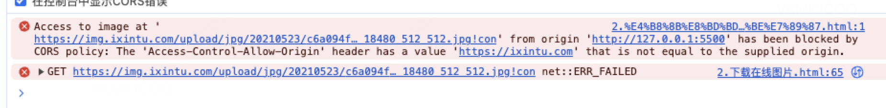

# 下载图片

## 1. 下载本地图片

大家一定都知道如何在网页上展示一张图片，把图片的链接挂载到`img`的src属性上。下载图片也是同理，把图片url挂载到`a`标签`href`属性上，并添加`download`属性告诉浏览器点击这个a标签不是跳转到图片地址，而是下载图片，从而可以达到下载的目的。

```html
<!-- 展示图片 -->


<!-- 下载图片 -->
<a href="./bgc.png" download="文件名">点击下载图片</a>
```
但是这样会存在一个问题，`url`如果是在线链接，会遇到点击`a`标签依旧不会下载，还是会跳转到图片地址。其实原因不难理解，被浏览器安全策略中同源策略给拦截了，造成了跨域，导致无法下载。

```html
<!-- 在线图片 -->

<a href="https://images.pexels.com/photos/26775381/pexels-photo-26775381.jpeg" download="文件名">点击下载图片</a>
```


## 2. 下载在线图片

解决办法就是将在线图片`url`转化为本地`url`，怎么转呢，得借助一下`canvas`元素，因为他身上有个方法<a href="https://developer.mozilla.org/zh-CN/docs/Web/API/HTMLCanvasElement/toDataURL" target="_blank">toDataURL</a>，可以将`canvas`元素转化为本地`url`。

核心思路就是：把图片转化为canvas，再把canvas转化为url，再通过a标签和这个url下载图片即可。

即图片 => canvas => url =>下载。

这里简单介绍下<a href="https://developer.mozilla.org/zh-CN/docs/Web/HTML/Element/canvas" target="_blank">canvas</a>：html中的一个标签元素，`<canvas>`，你可以把它理解为一个画布，在它内部可以绘制各种图案。

```html
<body>
  
  <button>下载图片</button>
</body>

<script>
  const img = document.querySelector("img");
  const button = document.querySelector("button");

  // 下载图片
  const downloadImg = (img, fileName, fileType, width, height) => {
    // 创建canvas画布
    const canvas = document.createElement("canvas");
    // 设置画布类型 2d可以理解画布能力是二维的平面 其他类型看mdn
    const ctx = canvas.getContext("2d");
    // 设置允许跨域访问
    img.crossOrigin = "Anonymous";

    // 设置crossOrigin属性后，浏览器会重新请求图片，所以需要等图片加载完毕后才绘制
    img.onload = () => {
      // 设置画布宽高（导出图片宽高） 跟图片宽高保持一致即可
      canvas.width = width;
      canvas.height = height;
      // 将图片绘制到画布上
      ctx.drawImage(img, 0, 0, canvas.width, canvas.height);
      document.body.appendChild(canvas);
      // 将canvas转化为DataURL 是一种资源协议，即前缀为 data: 协议，类似https:
      const url = canvas.toDataURL(`image/${fileType}`);
      // 通过a标签点击下载
      const a = document.createElement("a");
      // 设置下载地址
      a.href = url;
      // 设置下载图片名
      a.download = fileName;
      a.click();
    };
  };

  button.addEventListener("click", () => {
    downloadImg(img, "文件名", "jpeg", 100, 100);
  });
</script>

```
这里我们实现了自定义文件名、文件类型、图片宽高。

文件名：download属性指定。

文件类型：toDataURL这个方法可以指定类型，`png`，`webp`,`jpeg`，`gif`主流具体有哪些类型可以去看。

图片宽高：canvas宽高就是我们下载的图片宽高，如果小于图片的宽高，就会下载不全，最后我们在进阶里再来处理这个问题。


如果其中还是跨域报错的话，那就是这张图片所在的服务器不允许你去用哈，解决办法也很简单，自己手动下载到本地，使用本地路径就可以，哈哈哈，其实简单的办法就是都使用本地下载好的图片，也不用搞`canvas`转来转去，因为真实开发都使用的是同源（本地资源）图片。

但这里我其实并不是想给大家讲怎么解决下载在线图片问题，而是以此引导一下，怎么能把dom元素下载下来呢？

## 3. 下载dom元素

知道了怎么用canvas下载图片了，也可以用相同的道理下载dom元素，但是由于canvas本身不支持去绘制`dom`元素，也就是<a href="https://developer.mozilla.org/zh-CN/docs/Web/API/CanvasRenderingContext2D/drawImage" target="_blank">drawImage</a>不支持传dom元素，所以我们需要使用一个流行的canvas库：<a href="https://html2canvas.hertzen.com/" target="_blank">html2canvas</a>，它实现了处理dom元素转成canvas，我们再通过`toDataURL`将canvas转成`url`实现下载。

```html
<body>
  <div>
    
    <button>下载图片</button>
    <p>一行段落</p>
  </div>
</body>
<script>
const button = document.querySelector("button");
const div = document.querySelector("div");

// 下载图片
const downloadImg = (dom, fileName, fileType, width, height) => {
  // 使用 html2canvas 将 DOM 元素转换为 canvas
  html2canvas(div, {
    useCORS: true,
    width: width ?? div.clientWidth,
    height: height ??  div.clientHeight
  }).then((canvas) => {
    // 显示到网页上
    document.body.appendChild(canvas)
    const url = canvas.toDataURL(`image/${fileType ?? "png"}`);
    // 通过a标签点击下载
    const a = document.createElement("a");
    // 设置下载地址
    a.href = url;
    // 设置下载图片名
    a.download = fileName ?? "默认";
    // 触发点击
    a.click();
  })
};

button.addEventListener("click", () => {
  downloadImg(div, '111', 'jpeg');
});
</script>
```

## 4. 下载svg元素

### 1. 直接下载svg类型图片

svg元素本身是一个svg标签，我们可以直接将它序列化成`string`(html文本代码)，然后再将这串string转化为`base64编码`的url，通过这个url直接下载。

```html
<body>
  <svg
    version="1.1"
    baseProfile="full"
    width="300"
    height="200"
    xmlns="http://www.w3.org/2000/svg"
  >
    <rect width="100%" height="100%" fill="red" />
    <circle cx="150" cy="100" r="80" fill="green" />
    <text x="150" y="125" font-size="60" text-anchor="middle" fill="white">
      SVG
    </text>
  </svg>
  <button>点击下载</button>
  
</body>

<script>
  const svg = document.querySelector("svg");
  const button = document.querySelector("button");
  const img = document.querySelector('#img')
  const a = document.querySelector('a')

  button.addEventListener("click", () => {
    // dom => 序列化为string：其实就是html代码文本
    const svgData = new XMLSerializer().serializeToString(svg);
    // 转化为url
    const imgURI = "data:image/svg+xml;base64," + btoa(svgData)
    
    img.src = imgURI

    img.onload = () => {
      const a = document.createElement('a')
      a.href = imgURI
      a.download = 'img'
      a.click()
    }
  });
</script>
```

但是这里有一个缺陷，那就是只能将svg元素下载为svg图片，其他类型图片比如png、jpeg仍旧无法下载。

### 2. 下载其他类型

那如果我们要下载其他类型图片呢，我们同样可以借助canvas，我们现在可以将svg标签转化为svg图片了，然后把图片转化为canvas，通过canvas再转化为url。

核心思路：svg元素 => svg图片 => canvas => url => png/jpeg等其他类型。


```html

```